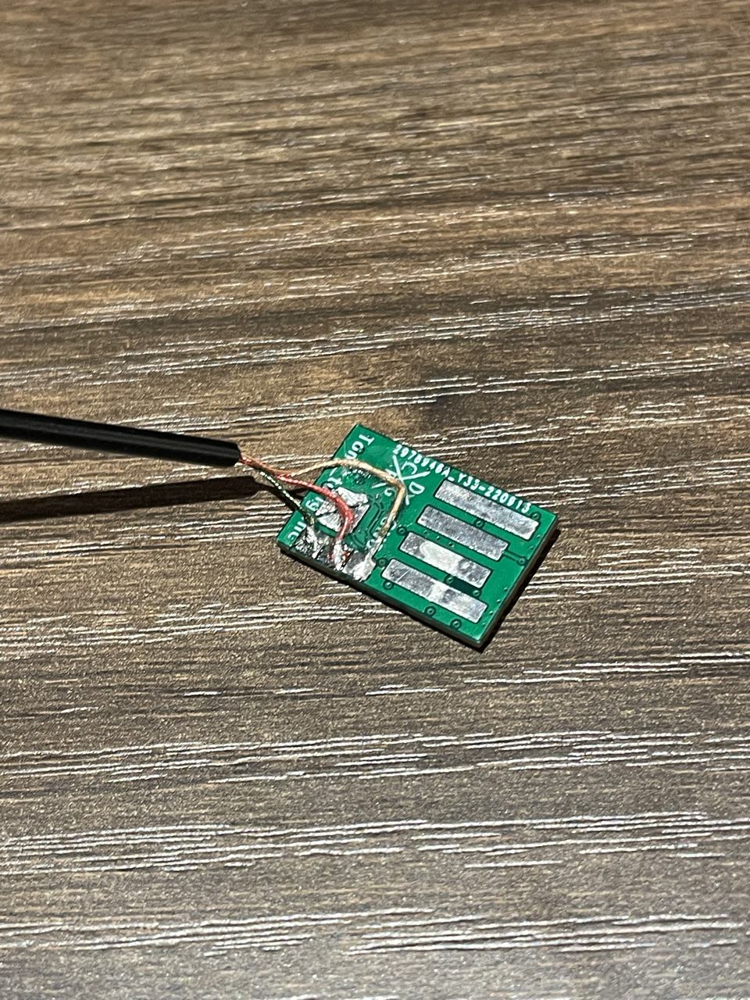
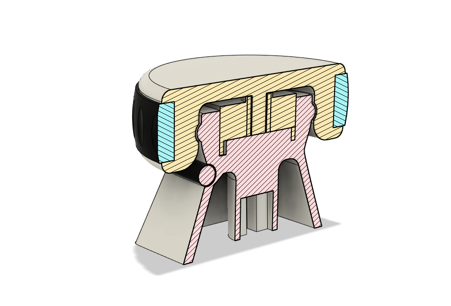
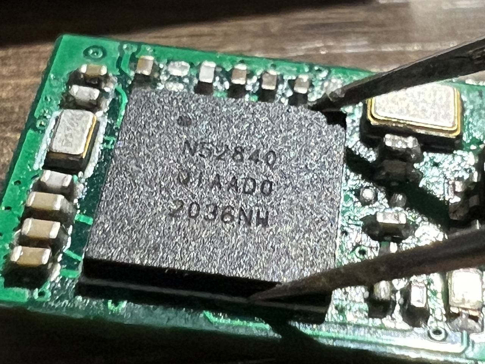

# Revolute
- NRF52840 Based One key Scroll wheel

## What you need to make this

- 0402 component hot plate soldering experience
- basic understanding of nrf52840 chip 
- alot of patience
- common sense

### Bill of materials: 
- <a href = "./3D Prints"> 3D Printed parts </a>
- <a href = "./Misc/Pictures/Revolute-Wire.png"> 2mm diameter 3 core wire </a>
- <a href = "./Misc/Pictures/Revolute-Encoder.png"> F-Switch E10E7-4-12-30 Rotary Encoder </a>
- <a href = "./Misc/Pictures/Scrollwheel.JPG"> MR0017 Scroll wheel </a>
- <a href = "./Hardware"> Pcb </a>
- <a href = "./Hardware/bom/ibom.html"> Pcb Components (iBOM) </a>

### Pcb 
- Revolute PCB is designed to act as its own usb plug, no need to solder male USB-A connectors. Just to be safe, glue a piece of card paper on the opposite side of the usb pins to prevent accidental short circuit.

- To wire the scroll wheel onto the pcb: Connect the middle pin on the encoder to the ground pad on the pcb above P1.01, Connect the two side pins of the encoder to 1.01 and 1.02 (left right doesnt matter)

-Picture of pins on the Revolute Pcb

### Software
- Custom Nrf25840 UF2 bootloader for Revolute can be found in the <a href = "./Bootloader"> Bootloader folder </a>, upload using a SWD programmer
- Pre compiled code can be found in the <a href = "./Revolute UF2 Variations"> Revolute UF2 Variations Folder </a> 

### 3D Printing & Others
- 3D printed parts are designed with a 0.2mm tolerance and the cap and base should snap together
- be careful when snapping the cap onto the base with the encoder, the center beam in the cap is very fragile and may snap off into your encoder.
- The rubber on the scroll wheel is salvaged from another <a href = "./Misc/Pictures/Scrollwheel.JPG"> scroll wheel </a>

## ---More pictures---
Section Analysis

 
Top view

 
Bottom view

 
Base only

 
Cap only

 
PCB

 

