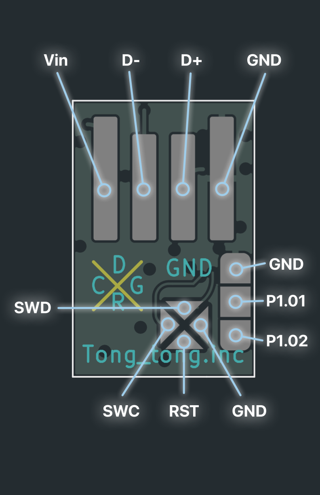

# Revolute
- NRF52840 Based One key Scroll wheel

## What you need to make this

- 0402 component hot plate soldering experience
- basic understanding of microchips 
- alot of patience
- common sense

### Bill of materials: 
- <a href = "./3D Prints"> 3D Printed parts </a>
- <a href = "./Misc/Pictures/Revolute-Wire.png"> 2mm diameter 3 core wire </a>
- F-Switch E10E7-4-12-30 Rotary Encoder
- <a href = "./Hardware"> Pcb </a>
- <a href = "./Hardware/bom/ibom.html"> Pcb Components (iBOM) </a>

### Pcb information
- Revolute PCB is designed to act as its own usb plug, no need to solder male USB-A connectors. Just to be safe, glue a piece of card paper on the opposite side of the usb pins to prevent accidental short circuit.

- To wire the scroll wheel onto the pcb: Connect the middle pin on the encoder to the ground pad on the pcb above P1.01, Connect the two side pins of the encoder to 1.01 and 1.02 (left right doesnt matter)

-Picture of pins on the Revolute Pcb

## ---More pictures---
Top view

 
Bottom view

 
Base only

 
Cap only

 

